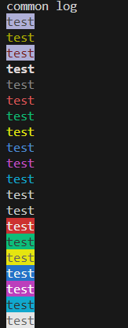
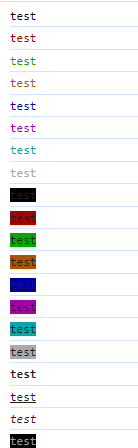

# Colorful Console

## Purpose

컬러플한 console을 사용하고 싶으면 Colorful Console이 완벽한 대안이 될수 있습니다. Terminal과 Web Console에서 로그에 스타일을 적용할 수 있습니다!
본 라이브러리는 https://codehs.com/tutorial/ryan/add-color-with-ansi-in-javascript에 영감을 받아 제작되었습니다.

!!일부 Web 환경에서 지원되지 않을수 있습니다.

## Feature

1. ESM, Commonjs, browser 환경의 모든 곳에서 라이브러리를 지원합니다.
2. 다양한 색깔과 배경을 지원하고 커스텀 할수 있습니다.
3. Type을 자체적으로 지원합니다.

## Prerequisites

- Node.js (Version 16, 18, 20 or later recommended)
- NPM (with an account that can publish packages)

## Getting Started

To get started with this template, clone the repository and follow the setup instructions.

```bash
npm install colorful-console
```

js, ts, browser 모든 환경에 지원합니다.
es5, es6 모두 지원합니다.

### JS

```javascript
const CC = require('colorful-console')

console.log("common log")

console.log(CC.bgCustom(146, "test"))
console.log(CC.colorCustom(142, "test"))

console.log(CC.color.red(CC.bgCustom(146, "test")))
console.log(CC.bold(CC.colorCustom(188, "test")))

const colorKeys = Object.keys(CC.color)
for (const key of colorKeys) {
    const method = CC.color[key]
    if (typeof method === 'function') {
        console.log(method("test")) 
    }
}

const bgKeys = Object.keys(CC.bg)
for (const key of bgKeys) {
    const method = CC.bg[key];
    if (typeof method === 'function') {
        console.log(method("test"))
    }
}
```

### Result


### TS
```typescript
import CC from 'colorful-console'
import { baseStyles } from '../src/data'
import type { CCFontStyleType, ColorType } from '../src/type'

console.log("common log")

console.log(CC.bgCustom(146, "test"))
console.log(CC.colorCustom(142, "test"))

console.log(CC.color.red(CC.bgCustom(146, "test")))
console.log(CC.bold(CC.colorCustom(188, "test")))

const colorKeys = Object.keys(CC.color) as Array<keyof ColorType>
for (const key of colorKeys) {
    const method = CC.color[key]
    if (typeof method === 'function') {
        console.log(method("test")) 
    }
}

const bgKeys = Object.keys(CC.bg) as Array<keyof ColorType>
for (const key of bgKeys) {
    const method = CC.bg[key];
    if (typeof method === 'function') {
        console.log(method("test"))
    }
}

const fontStyleKeys = Object.keys(CC) as Array<keyof CCFontStyleType>
for (const key of fontStyleKeys) {
    const method = CC[key]
    if (typeof method === 'function' && baseStyles.includes(key)) {
        console.log(method("test")) 
    }
}
```
### Result


### Browser
```html
<script src="../node_modules/colorful-console/dist/index.bundle.js"></script>
<script>

    const colorKeys = Object.keys(CC.color)
    for (const key of colorKeys) {
        const method = CC.color[key]
        if (typeof method === 'function') {
            console.log(method("test")) 
        }
    }

    const bgKeys = Object.keys(CC.bg)
    for (const key of bgKeys) {
        const method = CC.bg[key];
        if (typeof method === 'function') {
            console.log(method("test"))
        }
    }

    console.log(CC.bold("test"))
    console.log(CC.underline("test"))
    console.log(CC.italic("test"))

    CC.webConsole("color : #999999 ; background : #000000 ;", "test")

</script>
```
### Result


### Contributing
Contributions to this template are welcome. Please read the contributing guide for more information.

### License
Distributed under the MIT License. See LICENSE for more information.
